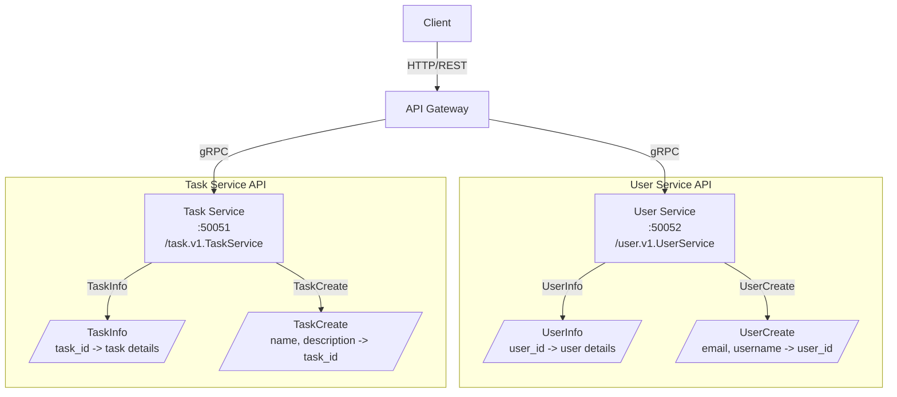

# GRPC Demo


## Architecture


## Run
```
docker compose up [--detach] --build
```

## Test
User service
```
grpcurl -plaintext -d '{"user_id": "123"}' localhost:50052 user.v1.UserService/UserInfo
grpcurl -plaintext -d '{"email": "new@example.com", "username": "newuser"}' localhost:50052 user.v1.UserService/UserCreate
```

Task service
```
grpcurl -plaintext -d '{"name": "My New Task", "description": "This is a task grpcurl -plaintext -d '{"task_id": "123e4567-e89b-12d3-a456-426614174000"}' localhost:50051 task.v1.TaskService/TaskInfo
```
