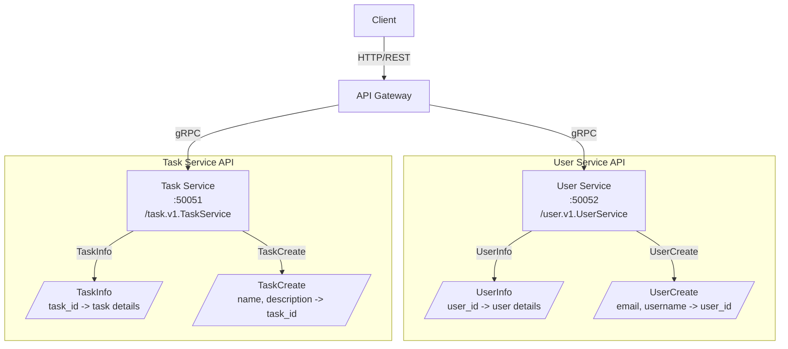

# User service

User management. Login, info, etc.

```mermaid
flowchart TD
    Client[Client] -->|HTTP/REST| Gateway[API Gateway]
    Gateway -->|gRPC| UserService[User Service<br>:50052<br>/user.v1.UserService]
    Gateway -->|gRPC| TaskService[Task Service<br>:50051<br>/task.v1.TaskService]
    
    subgraph User Service API
        UserService -->|UserInfo| UserInfo[/UserInfo<br>user_id -> user details/]
        UserService -->|UserCreate| UserCreate[/UserCreate<br>email, username -> user_id/]
    end
    
    subgraph Task Service API
        TaskService -->|TaskInfo| TaskInfo[/TaskInfo<br>task_id -> task details/]
        TaskService -->|TaskCreate| TaskCreate[/TaskCreate<br>name, description -> task_id/]
    end
```
